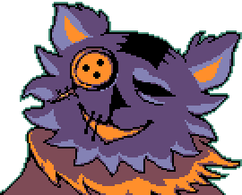
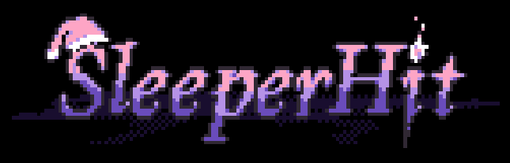
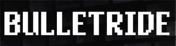

<h1 align="center"> Oh, greetings! Come in...</h1>

  

<h2 align="center"> About me </h2>

 Hi, I'm Alvesito, but you can just call me Alves. I'm a software engineering student at University of Oviedo, and I'm currently in third grade. I love everything related to software, especially fields like graphics engines and video game development. 

 I also make games in my free time! If you're interested, you can check them out below.

<h2 align="center"> My games </h2>

    

    
    
Release coming soon...

<!--
**alvesit0/alvesit0** is a ✨ _special_ ✨ repository because its `README.md` (this file) appears on your GitHub profile.

Here are some ideas to get you started:

- 🔭 I’m currently working on ...
- 🌱 I’m currently learning ...
- 👯 I’m looking to collaborate on ...
- 🤔 I’m looking for help with ...
- 💬 Ask me about ...
- 📫 How to reach me: ...
- 😄 Pronouns: ...
- ⚡ Fun fact: ...
-->
